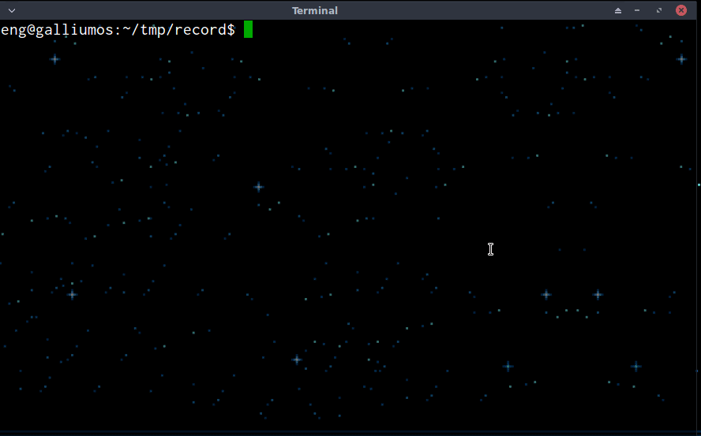

dilbert.sh - A dailly visitor for Dilbert's website
---------------------------------------------------

```
Usage: dilbert.sh [option]
(shows the latest comic strip if option is ommited)

[option] list:
--keep      Keeps dilbert_temp.gif file after quitting
--quiet_keep    Keeps dilbert_temp.gif file and don't run viewer
--select    Selects a date
--help      Shows this message
--version   Shows current version
```

Requires:
- w3m
- wget
- dialog
- feh or fbi

Screenshot
----------

This is how to use it...




